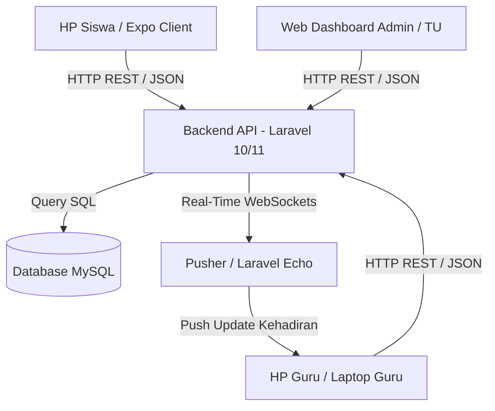

# DOKUMENTASI SISTEM & BUKU PANDUAN PENGGUNAAN (MANUAL BOOK)
# **RAJASA ACADEMIC SYSTEM (RAS)**

---

## 📋 1. DESKRIPSI UMUM SISTEM

**Rajasa Academic System (RAS)** adalah ekosistem digital terpadu sekolah menengah kejuruan yang dirancang khusus untuk memodernisasi administrasi kehadiran (absensi) di **SMKS Rajasa Surabaya**. 

Sistem ini memecahkan berbagai masalah absensi konvensional (seperti manipulasi kehadiran siswa, inefisiensi waktu belajar, dan rumitnya rekapitulasi data bulanan) dengan memanfaatkan teknologi pelacakan lokasi berbasis GPS (Geofencing), autentikasi biometrik, pembagian mode absensi kelas yang fleksibel, dan kedaulatan veto kehadiran di tangan guru pengampu.

Secara umum, sistem ini berjalan secara sinkron di mana siswa mengisi kehadiran melalui smartphone mereka, guru memantau secara realtime dan dapat melakukan penolakan jika terjadi kecurangan, serta staf Tata Usaha (TU) dapat mengelola seluruh data master dan mengunduh laporan siap cetak.

### 🏫 1.1 PROFIL MITRA SEKOLAH: SMKS RAJASA SURABAYA

Aplikasi RAS diimplementasikan bersama **SMKS Rajasa Surabaya** sebagai mitra utama. Berikut adalah data profil instansi sekolah mitra:
* **Nama Sekolah**: SMK Swasta Rajasa Surabaya
* **NPSN**: 20532681
* **Status Sekolah**: Swasta (Terakreditasi A)
* **Alamat Fisik**: Jl. Gentengkali No. 27, Kelurahan Genteng, Kecamatan Genteng, Kota Surabaya, Jawa Timur (Koordinat Absensi Geofence ditetapkan pada radius 100m dari titik ini).
* **Kontak Utama**: (031) 5344810 | Email: `smkrjs.sby@smkrajasa.sch.id`
* **Program/Kompetensi Keahlian Kejuruan**:
  1. **Teknik Jaringan Komputer dan Telekomunikasi (TJKT / TKJ)**: Kompetensi keahlian yang fokus pada pemrograman, administrasi server, infrastruktur jaringan, dan integrasi IoT (penyedia infrastruktur utama RAS).
  2. **Teknik Ketenagalistrikan (TITL)**: Kompetensi kelistrikan industri dan instalasi domestik.
  3. **Teknik Pemesinan**: Kompetensi pengoperasian mesin industri (bubut, CNC, dll).
  4. **Teknik Otomotif (TKRO)**: Kompetensi perbaikan kendaraan ringan dan sistem kelistrikan mobil.
  5. **Manajemen Perkantoran (MPLB / OTKP)**: Kompetensi administrasi perkantoran modern dan tata kelola dokumen.
  6. **Akuntansi dan Keuangan Lembaga (AKL)**: Kompetensi pembukuan dan analisis transaksi finansial.

---

## 🛠️ 2. TECH STACK & ARSITEKTUR TEKNOLOGI

Aplikasi RAS menggunakan arsitektur modern berbasis decoupling antara **Frontend Client** (mobile & web) dengan **Backend Server API**:

### **A. Backend Server (RESTful API)**
* **Bahasa & Framework**: PHP 8.x, Laravel Framework 10.x / 11.x.
* **Autentikasi**: Laravel Sanctum (berbasis Bearer Tokens yang aman dan stateless).
* **Database**: MySQL (untuk penyimpanan data relasional terstruktur: data siswa, guru, kelas, jadwal, dan rekapitulasi absensi).
* **Real-time Event**: Laravel Echo & Pusher JS (untuk sinkronisasi daftar kehadiran di layar Guru tanpa perlu refresh manual).
* **Penanganan Cron/Just-in-Time (JIT)**: Sistem deteksi otomatis status sesi presensi yang kedaluwarsa saat data schedule diakses.

### **B. Frontend Client (Multi-Platform Mobile & Web)**
* **Bahasa & Framework**: TypeScript, React Native (berbasis Expo SDK 54).
* **Routing**: Expo Router (berbasis navigasi direktori yang modern).
* **Desain UI**: Vanilla CSS & React Native StyleSheet dengan pendekatan komponen modular, animasi mikro, dan tampilan responsif (Desktop/Web & Mobile).
* **Penyimpanan Lokal**: React Native Async Storage (untuk menyimpan token sesi login secara aman).
* **API Client**: Axios dengan Interceptor (untuk handling token JWT otomatis dan respon error).
* **Fitur Perangkat Keras**:
  * `expo-location`: Deteksi koordinat GPS presisi dan pencegahan kecurangan berbasis aplikasi Fake GPS.
  * `expo-camera`: Memindai QR Code sesi presensi guru.
  * `expo-local-authentication`: Integrasi sensor Biometrik sidik jari / Face ID untuk absensi mandiri.

---

## ✨ 3. FITUR UTAMA RAJASA ACADEMIC SYSTEM (RAS)

| Nama Fitur | Deskripsi | Aktor Terkait |
| :--- | :--- | :--- |
| **Daily Geofenced Check-In** | Absensi harian sekolah berdasarkan radius lokasi GPS (maksimal 100m dari koordinat sekolah) untuk memfilter kehadiran murid di area SMKS Rajasa Surabaya. | Siswa |
| **Kalkulator Keterlambatan** | Penghitungan menit keterlambatan secara otomatis jika siswa melakukan check-in di luar batas toleransi jam masuk (misal di atas jam 07:00 WIB). | Siswa, Wali Kelas, TU |
| **Dual-Mode Presensi Mapel** | Guru dapat memilih metode presensi mapel: **Klik Tombol Mandiri** (cepat, efisien, minim antrian) atau **Scan QR Code** (keamanan tingkat tinggi). | Guru, Siswa |
| **Hak Veto Guru (Override)** | Hak guru untuk menolak kehadiran siswa secara instan lewat dashboard real-time jika siswa terdeteksi curang atau absen dari luar kelas. | Guru |
| **Fleksibilitas Sesi & Reopen** | Guru dapat mengaktifkan kelas lampau (yang terlewat) serta mengatur waktu tutup presensi secara manual/otomatis. | Guru |
| **Perizinan Digital** | Siswa dapat mengunggah berkas surat sakit/izin langsung melalui aplikasi, dan guru/wali kelas dapat melakukan approval. | Siswa, Guru, Wali Kelas |
| **Manajemen Master Data** | Pengelolaan data induk siswa, guru, kelas, kurikulum mapel, dan penjadwalan mingguan. | Admin TU |
| **Ekspor Laporan Bulanan** | Pengunduhan laporan kehadiran berformat PDF siap cetak (A4) dan format Excel/CSV untuk arsip data kehadiran resmi sekolah. | Admin TU |

---

## 📖 4. BUKU PANDUAN PENGGUNAAN (MANUAL BOOK)

Di bawah ini adalah langkah-langkah penggunaan sistem RAS per aktor lengkap dengan deskripsi gambar yang dapat diisi oleh pengembang/sekolah dengan screenshot layar aplikasi.

---

### 👨‍💻 4.1. PANDUAN ADMINISTRATOR (TATA USAHA)

Staf Tata Usaha memegang hak akses tertinggi dalam mengelola data master sekolah serta melakukan pengarsipan berkas rekap absensi.

#### **Langkah 1: Mengakses & Login Halaman Admin Web**
1. Buka browser komputer Anda dan ketikkan alamat domain aplikasi RAS (misal: `https://ras.smksrajasa.sch.id`).
2. Masukkan alamat **Email** dan **Password** akun administrator Anda.
3. Klik tombol **"Masuk Sistem"**.

> [!IMPORTANT]
> **[TANGKAPAN LAYAR: LOGIN ADMIN]**
> * **Lokasi Gambar**: Tempatkan file gambar di direktori proyek `assets/screenshots/admin_login.png`.
> * **Instruksi Foto**: Tampilkan halaman login web admin yang memuat kolom email, password, logo sekolah, serta tombol login.

#### **Langkah 2: Mengelola Data Induk (Siswa, Guru, Kelas, Jurusan, & Mapel)**
1. Setelah login berhasil, Anda akan masuk ke **Dashboard Utama TU**.
2. Pada menu sidebar sebelah kiri, pilih kategori data yang ingin dikelola (misal: **Data Siswa**).
3. Anda dapat menekan tombol **"Tambah Siswa"** untuk menambahkan data baru secara manual, atau menggunakan tombol **"Hapus"** / **"Edit"** di tabel data siswa.

> [!IMPORTANT]
> **[TANGKAPAN LAYAR: KELOLA DATA SISWA]**
> * **Lokasi Gambar**: Tempatkan file gambar di direktori proyek `assets/screenshots/admin_data_siswa.png`.
> * **Instruksi Foto**: Tampilkan halaman tabel data siswa (Premium Data Table) di web admin, memperlihatkan list data siswa dengan kolom NISN, Nama, Kelas, Jurusan, dan tombol aksi Edit/Hapus.

#### **Langkah 3: Mengatur Jadwal Pelajaran Mingguan**
1. Pada menu navigasi sidebar, pilih menu **"Jadwal Pelajaran"**.
2. Pilih kelas dan hari pelajaran (Senin s.d Jumat).
3. Klik tombol **"Tambah Jadwal"**, tentukan mata pelajaran, guru pengampu, jam mulai, jam selesai, serta nomor ruangan kelas. Klik **"Simpan"**.

> [!IMPORTANT]
> **[TANGKAPAN LAYAR: KELOLA JADWAL PELAJARAN]**
> * **Lokasi Gambar**: Tempatkan file gambar di direktori proyek `assets/screenshots/admin_jadwal.png`.
> * **Instruksi Foto**: Tampilkan formulir atau daftar input jadwal pelajaran di web admin, memperlihatkan pemilihan mapel, guru, jam belajar, dan nama ruangan.

#### **Langkah 4: Rekap & Ekspor Laporan Kehadiran (PDF/Excel)**
1. Klik menu **"Laporan Absensi"** di sidebar.
2. Filter data berdasarkan **Rentang Tanggal**, **Kelas**, atau **Mata Pelajaran** tertentu.
3. Klik tombol **"Unduh Laporan (PDF)"** untuk mencetak file PDF siap cetak ukuran A4, atau **"Unduh Laporan (Excel)"** untuk arsip rekap spreadsheet.

> [!IMPORTANT]
> **[TANGKAPAN LAYAR: REKAP DAN EKSPOR LAPORAN]**
> * **Lokasi Gambar**: Tempatkan file gambar di direktori proyek `assets/screenshots/admin_ekspor_laporan.png`.
> * **Instruksi Foto**: Tampilkan layar halaman pelaporan admin web yang memuat pilihan filter tanggal, kelas, serta tombol ekspor berformat PDF dan Excel.

---

### 👩‍🏫 4.2. PANDUAN GURU

Guru memegang kontrol penuh atas pembukaan sesi belajar mengajar serta verifikasi fisik kehadiran murid di dalam kelas.

#### **Langkah 1: Login Akun Guru & Dashboard Jadwal Harian**
1. Buka aplikasi RAS di smartphone Anda atau kunjungi halaman web Guru di browser.
2. Masukkan username/email dan password guru Anda.
3. Anda akan disambut oleh dashboard yang menampilkan **Jadwal Pelajaran Anda Hari Ini**.

> [!IMPORTANT]
> **[TANGKAPAN LAYAR: DASHBOARD JADWAL GURU]**
> * **Lokasi Gambar**: Tempatkan file gambar di direktori proyek `assets/screenshots/guru_dashboard.png`.
> * **Instruksi Foto**: Tampilkan dashboard guru pada smartphone yang memuat daftar jadwal mata pelajaran aktif yang diampu guru tersebut pada hari ini.

#### **Langkah 2: Membuka Sesi Presensi Kelas**
1. Pada kartu jadwal pelajaran aktif, tekan tombol **"Buka Presensi Kelas"**.
2. Konfigurasikan sesi absensi:
   * **Tanggal Presensi**: Default hari ini (Guru juga bisa memilih tanggal lampau untuk membuka sesi susulan/reopen).
   * **Metode Presensi**: Centang/pilih **Hanya Klik Tombol (Mandiri)** atau **Scan QR Code**.
   * **Batas Waktu Tutup**: Masukkan jam tutup secara manual atau klik tombol preset rekomendasi **"Akhir Jam Pelajaran"** (jam selesai + 15 menit).
3. Klik tombol **"Buka Presensi Sekarang"**.

> [!IMPORTANT]
> **[TANGKAPAN LAYAR: CONFIG MODAL BUKA PRESENSI]**
> * **Lokasi Gambar**: Tempatkan file gambar di direktori proyek `assets/screenshots/guru_buka_presensi_modal.png`.
> * **Instruksi Foto**: Tampilkan modal popup konfigurasi buka presensi di HP Guru, yang memuat pilihan metode (klik tombol/scan QR), input tanggal presensi, serta input jam & menit untuk waktu tutup presensi.

#### **Langkah 3: Memantau Presensi Siswa Real-Time & Menggunakan Hak Veto**
1. Setelah sesi dibuka, layar guru akan menampilkan hitung mundur waktu penutupan otomatis dan QR Code (jika mode QR diaktifkan).
2. Di bagian bawah terdapat **Daftar Siswa Kelas** yang terintegrasi secara realtime:
   * Status siswa akan otomatis berubah menjadi "Hadir/Telat" begitu mereka absen di HP-nya.
   * **Hak Veto (Override)**: Jika guru melihat siswa terdaftar hadir tetapi fisiknya tidak ada di kelas, klik **Tombol Merah (Tolak)** di samping nama siswa tersebut untuk membatalkan kehadirannya seketika.

> [!IMPORTANT]
> **[TANGKAPAN LAYAR: MONITORING GURU & HAK VETO]**
> * **Lokasi Gambar**: Tempatkan file gambar di direktori proyek `assets/screenshots/guru_monitoring.png`.
> * **Instruksi Foto**: Tampilkan halaman detail sesi aktif di HP Guru. Tampilkan sisa waktu penutupan presensi, QR Code, dan daftar nama siswa beserta tombol veto merah di sisi paling kanan.

#### **Langkah 4: Menutup Sesi Presensi**
1. Sesi presensi akan **tertutup secara otomatis** begitu hitung mundur waktu tutup yang dikonfigurasi mencapai angka nol.
2. Jika guru ingin menyudahi sesi absensi lebih awal karena semua murid telah hadir, klik tombol merah **"Tutup Kelas"** pada layar dashboard kontrol untuk menutup paksa sesi absensi saat itu juga.

> [!IMPORTANT]
> **[TANGKAPAN LAYAR: TUTUP KELAS GURU]**
> * **Lokasi Gambar**: Tempatkan file gambar di direktori proyek `assets/screenshots/guru_tutup_kelas.png`.
> * **Instruksi Foto**: Tampilkan modal konfirmasi atau tombol "Tutup Kelas" di HP Guru beserta notifikasi bahwa sesi absensi mapel telah berhasil dinonaktifkan.

---

### 🎒 4.3. PANDUAN SISWA

Siswa menggunakan aplikasi mobile di smartphone mereka untuk membuktikan kehadiran harian di sekolah dan mengklaim absensi mata pelajaran.

#### **Langkah 1: Login & Memeriksa Dashboard Kehadiran**
1. Buka aplikasi RAS di HP Anda.
2. Masukkan **NISN / Username** dan password Anda.
3. Di halaman beranda, Anda akan melihat kartu ringkasan status kehadiran harian Anda, riwayat absensi, serta tombol cepat absensi harian.

> [!IMPORTANT]
> **[TANGKAPAN LAYAR: DASHBOARD BERANDA SISWA]**
> * **Lokasi Gambar**: Tempatkan file gambar di direktori proyek `assets/screenshots/siswa_dashboard.png`.
> * **Instruksi Foto**: Tampilkan dashboard utama aplikasi siswa di HP. Perlihatkan ringkasan status kehadiran (Hadir/Belum Absen), nama siswa, NISN, dan tombol navigasi utama.

#### **Langkah 2: Absen Harian Masuk Sekolah (Geofence GPS)**
1. Di pagi hari sebelum masuk kelas, pastikan Anda telah berada di dalam lingkungan sekolah (radius 100m) dan mengaktifkan GPS.
2. Klik tombol **"Absen Masuk Sekolah"** di beranda.
3. Sistem akan memvalidasi koordinat GPS Anda. Jika valid dan di bawah jam 07:00 WIB, Anda sukses tercatat **"Hadir"**. Jika lewat jam 07:00 WIB, status Anda berubah otomatis menjadi **"Terlambat"** beserta jumlah menit keterlambatan.

> [!IMPORTANT]
> **[TANGKAPAN LAYAR: ABSEN HARIAN GEOFENCE]**
> * **Lokasi Gambar**: Tempatkan file gambar di direktori proyek `assets/screenshots/siswa_absen_harian.png`.
> * **Instruksi Foto**: Tampilkan layar saat siswa melakukan proses absen masuk harian berbasis GPS sekolah. Perlihatkan notifikasi koordinat berhasil diverifikasi atau loading deteksi lokasi.

#### **Langkah 3: Mengisi Presensi Mata Pelajaran Aktif**
Jika guru pengampu Anda telah mengaktifkan sesi pelajaran, ikuti instruksi berikut berdasarkan mode yang dipilih guru:
* **A. Jika Mode Klik Mandiri**:
  1. Masuk ke menu **Presensi** di navigasi bawah.
  2. Tekan tombol hijau **"Kirim Kehadiran"**.
  3. Aplikasi akan otomatis mendeteksi lokasi dan mengirim data kehadiran Anda tanpa perlu scan.
* **B. Jika Mode Scan QR Code**:
  1. Masuk ke menu **Presensi**, pilih metode **Scan QR Guru**.
  2. Arahkan kamera HP Anda ke QR Code yang ditampilkan oleh Guru (di layar HP Guru atau Proyektor).
  3. Tunggu hingga layar menampilkan modal hijau bertuliskan **"Presensi Berhasil"**.

> [!IMPORTANT]
> **[TANGKAPAN LAYAR: PRESENSI MAPEL AKTIF SISWA]**
> * **Lokasi Gambar**: Tempatkan file gambar di direktori proyek `assets/screenshots/siswa_presensi_aktif.png`.
> * **Instruksi Foto**: Tampilkan antarmuka halaman detail presensi mapel di HP Siswa. Perlihatkan tombol hijau "Kirim Kehadiran" untuk mode Mandiri, or tunjukkan frame scanner kamera aktif untuk memindai QR guru.

#### **Langkah 4: Mengajukan Surat Keterangan Sakit / Izin Digital**
1. Jika berhalangan hadir ke sekolah, pilih menu **"Pengajuan Izin"** di beranda.
2. Pilih jenis permohonan (**Sakit** atau **Izin**).
3. Isi kolom alasan ketidakhadiran, tanggal mulai izin, dan tanggal berakhir izin.
4. Klik tombol **"Pilih Berkas"** untuk memfoto Surat Dokter atau Surat Keterangan Orang Tua dari kamera HP Anda.
5. Klik **"Kirim Pengajuan"**.

> [!IMPORTANT]
> **[TANGKAPAN LAYAR: PENGAJUAN IZIN SISWA]**
> * **Lokasi Gambar**: Tempatkan file gambar di direktori proyek `assets/screenshots/siswa_pengajuan_izin.png`.
> * **Instruksi Foto**: Tampilkan layar formulir pengajuan izin sakit/izin digital di HP Siswa. Perlihatkan kolom tanggal, alasan izin, input lampiran foto surat keterangan, dan tombol kirim.

---

## 🗂️ 5. DAFTAR SYNC TANGKAPAN LAYAR (SUMMARY)

Untuk mempermudah pengisian berkas manual book ini, berikut daftar lengkap file tangkapan layar yang harus disiapkan oleh tim pengembang/sekolah dan diletakkan pada folder `/assets/screenshots/`:

1. 🔏 **`admin_login.png`**: Form login admin Tata Usaha pada browser desktop.
2. 👥 **`admin_data_siswa.png`**: Halaman kelola data induk siswa berupa tabel data modern.
3. 📅 **`admin_jadwal.png`**: Formulir penjadwalan kelas mingguan.
4. 📂 **`admin_ekspor_laporan.png`**: Halaman pengunduhan laporan kehadiran berformat PDF & Excel.
5. 📊 **`guru_dashboard.png`**: Beranda dashboard guru yang memuat jadwal mengajar harian.
6. ⚙️ **`guru_buka_presensi_modal.png`**: Popup setting modal pembukaan presensi mapel (tanggal, metode, jam tutup).
7. 🔴 **`guru_monitoring.png`**: Halaman kontrol real-time guru (QR Code sesi, hitung mundur, dan tombol veto tolak siswa).
8. 🛑 **`guru_tutup_kelas.png`**: Notifikasi konfirmasi penutupan kelas secara manual.
9. 📱 **`siswa_dashboard.png`**: Beranda dashboard siswa di aplikasi mobile Expo.
10. 🗺️ **`siswa_absen_harian.png`**: Proses loading verifikasi GPS absen harian sekolah.
11. 🟢 **`siswa_presensi_aktif.png`**: Detail halaman presensi mapel aktif di sisi siswa (tombol absen mandiri / scan QR).
12. 📝 **`siswa_pengajuan_izin.png`**: Formulir pengunggahan surat dokter/izin digital.

---

## 🌐 6. PANDUAN PENYELESAIAN MASALAH DEPLOYMENT (TROUBLESHOOTING VERCEL 404)

Jika saat mengakses URL deployment Vercel (seperti `sistem-absensi-rajasa-1gfr.vercel.app`) Anda mendapatkan halaman error **`404: NOT_FOUND (Code: NOT_FOUND)`**, hal tersebut terjadi karena ketidaksesuaian konfigurasi folder utama atau folder kompilasi proyek pada setelan Vercel. 

Berikut adalah panduan lengkap cara menyelesaikannya:

### **Penyebab Utama:**
1. **Root Directory Salah**: Vercel membaca folder root utama repository (`/`) alih-alih folder `/frontend`. Karena root tidak memiliki `index.html` statis ataupun build script web utama, Vercel gagal memetakan halaman.
2. **Output Directory Salah**: Proyek React Native Web berbasis Expo SDK 54 mengompilasi file statis ke folder `dist` (melalui perintah `expo export`), sementara Vercel secara default mencari folder `public` atau `build`.

### **Langkah Solusi & Konfigurasi di Vercel Dashboard:**
1. Masuk ke akun **Vercel** Anda dan pilih proyek **`sistem-absensi-rajasa`** dari dashboard.
2. Klik tab **"Settings"** di barisan menu atas proyek.
3. Di dalam menu **"General"**, cari bagian **"Root Directory"**:
   * Klik tombol edit dan arahkan/pilih folder **`frontend`** (atau ketik langsung `frontend` di kolom tersebut).
   * Klik **"Save"**.
4. Di bagian **"Build & Development Settings"**, lakukan konfigurasi override berikut:
   * **Build Command**: Pastikan terisi `npm run build` (atau `expo export` / `npx expo export`).
   * **Output Directory**: Aktifkan toggle **Override** (geser ke kanan) di sebelah Output Directory, lalu ketik **`dist`** di kolom isian tersebut.
   * Klik **"Save"**.
5. Setelah semua setelan disimpan, buka tab **"Deployments"** di menu atas.
6. Pilih rilis deployment terbaru yang error, klik tombol opsi (tiga titik horizontal) di sebelah kanan, dan pilih **"Redeploy"**.
7. Tunggu proses kompilasi ulang selesai. Setelah selesai, akses kembali URL Vercel Anda dan halaman web absensi akan langsung terbuka dengan normal.

---
*Dokumen manual book ini dibuat demi kemudahan implementasi digital SMKS Rajasa Surabaya. Silakan ganti placeholder gambar dengan tangkapan layar sistem yang sesungguhnya sesuai panduan di atas.*
