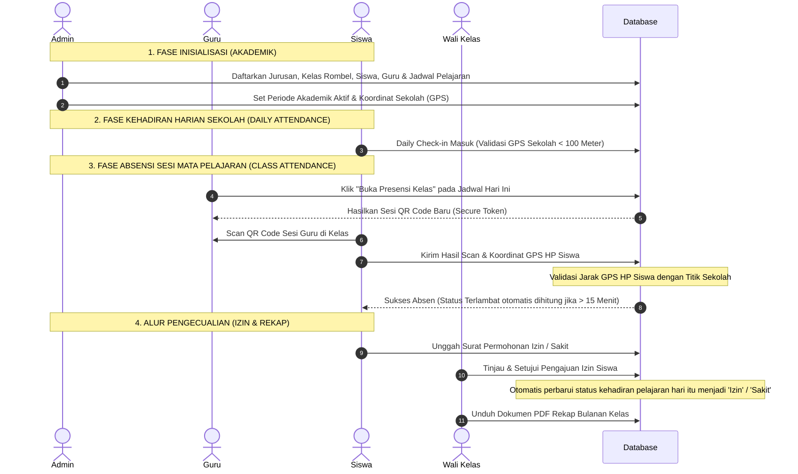

# 📚 Sistem Absensi Digital SMKS Rajasa Surabaya

<p align="center">
  
</p>

Sistem Absensi Digital berbasis mobile untuk **SMKS Rajasa Surabaya** - Aplikasi absensi siswa modern berbasis mata pelajaran (**Subject & Session Based QR**) menggunakan QR Code secure token, validasi lokasi GPS (`expo-location`), serta pengelolaan data otomatis berbasis **Periode Akademik & Sistem Paket Kelas**.

---

## 📋 Daftar Isi
- [Deskripsi](#-deskripsi)
- [Karakteristik SMKS Rajasa](#-karakteristik-smks-rajasa)
- [Alur Absensi Hibrida](#-alur-absensi-hibrida)
- [Fitur Keamanan, Performa & UX Terbaru](#-fitur-keamanan-performa--ux-terbaru)
- [Tech Stack](#-tech-stack)
- [Struktur Database](#-struktur-database)
- [Relasi Tabel](#-relasi-tabel)
- [User & Role Uji Coba](#-user--role-uji-coba)
- [Data Simulasi Seeder](#-data-simulasi-seeder)
- [API Endpoints Baru](#-api-endpoints-baru)
- [Instalasi](#-instalasi)

---

## 📝 Deskripsi

Sistem Absensi Digital SMKS Rajasa dirancang khusus untuk memodernisasi absensi sekolah dengan tingkat keamanan tinggi. Sistem ini mencatat kehadiran **per sesi mata pelajaran sesuai jadwal hari ini**, mencegah siswa bolos di tengah hari sekolah, serta memudahkan Wali Kelas, Guru, dan Kepala Sekolah memonitor rekap kehadiran secara realtime.

---

## 🏫 Karakteristik SMKS Rajasa

Sistem absensi ini diselaraskan dengan aturan dan profil riil **SMKS Rajasa Surabaya**:
1. **6 Jurusan / Kompetensi Keahlian**:
   * **AKL** (Akuntansi dan Keuangan Lembaga)
   * **MP** (Manajemen Perkantoran)
   * **TITL** (Teknik Instalasi Tenaga Listrik)
   * **TKRO** (Teknik Kendaraan Ringan Otomotif)
   * **TKJ** (Teknik Komputer dan Jaringan)
   * **TPM** (Teknik Pemesinan)
2. **Sistem 5 Hari Kerja (Full Day)**: 
   Jadwal pelajaran (`schedules`) dikonfigurasi hanya untuk **Senin s.d. Jumat**. Status keterlambatan dihitung secara dinamis per sesi pelajaran berdasarkan toleransi 15 menit dari jam mulai (`start_time`), adil untuk transisi kelas Full Day.
3. **Struktur Kelas Rombel yang Riil**: 
   Penamaan kelas menggunakan format formal rombel SMK (misal: `X TKJ 1`, `XI AKL 1`, `XII TPM 1`) untuk menampung skala rombel sekolah.
4. **Sistem Paket Kelas (Periode Akademik)**:
   Siswa tidak perlu merancang jadwal (KRS) manual. Siswa dipaketkan langsung ke suatu kelas untuk Periode Aktif berjalan (misal: *Semester Ganjil 2025/2026*). Saat ganti semester, data lama tersimpan rapi sebagai arsip dan siswa dinaikkan ke kelas baru.

---

## 🔄 Alur Absensi Hibrida (Session-Based QR)

Sistem menyediakan metode absensi hibrida dinamis di dalam kelas:

* **Opsi 1: Siswa Scan QR Guru (Rekomendasi)**:
  1. Guru menekan tombol **"Buka Presensi Kelas"** di jadwal hari ini pada Beranda (mengaktifkan sesi absensi baru).
  2. Aplikasi Guru menampilkan **QR Code Sesi** (berisi token unik secure).
  3. Siswa masuk ke menu scan di HP-nya, memindai QR Guru, dan aplikasi otomatis mendeteksi koordinat GPS (`expo-location`).
  4. Server Laravel memvalidasi jarak GPS siswa dengan koordinat sekolah SMKS Rajasa Surabaya (Lat: `-7.245583`, Lng: `112.737750`). Jika berada di luar radius 100 meter, absensi ditolak untuk mencegah titip absen.
* **Opsi 2: Guru Scan QR Siswa (Cadangan)**:
  1. Siswa menekan **"Tampilkan QR Absen Saya"** di HP-nya yang menghasilkan token unik berbatas waktu.
  2. Guru mengaktifkan kamera pemindai di HP Guru untuk men-scan QR tersebut. Kehadiran tercatat instan di HP siswa.

---

## ⚡ Fitur Keamanan, Performa & UX Terbaru

Sistem absensi ini telah ditingkatkan dengan serangkaian fitur keamanan tingkat tinggi, optimalisasi database, serta penyempurnaan pengalaman pengguna (UX):

1. **🔑 Verifikasi Biometrik (Sidik Jari / Face ID)**:
   - Sebelum siswa dapat melakukan *Daily Check-in*, memindai QR Guru, atau menampilkan QR personal mereka, aplikasi akan memicu verifikasi biometrik native (`expo-local-authentication`).
   - Skenario ini secara absolut mencegah kecurangan penitipan HP/akun antarsiswa.
   - Sistem secara otomatis menggunakan pola/sandi/PIN layar kunci HP jika biometrik tidak didaftarkan, dan dilewati (bypass) secara aman pada platform web browser.

2. **📱 Student Device Binding (Satu Akun Satu HP)**:
   - Saat pertama kali siswa melakukan absensi di suatu perangkat mobile, UUID perangkat tersebut akan dikunci (*bound*) ke akun siswa.
   - Jika siswa mencoba login dan absen menggunakan ponsel lain, sistem akan memblokir tindakan tersebut dengan pesan kesalahan meminta reset perangkat.
   - Admin atau Guru dapat mereset kunci perangkat siswa secara aman melalui tombol reset perangkat di panel kelola data siswa di admin dashboard.

3. **📅 Pembatasan Persetujuan & Visibilitas Izin Berdasarkan Jadwal Mengajar**:
   - Guru pengajar hanya dapat melihat, menyetujui, atau menolak pengajuan surat izin siswa jika guru tersebut memiliki jadwal mengajar di kelas siswa terkait pada setidaknya salah satu hari/tanggal dalam rentang pengajuan izin.
   - Data izin siswa yang tidak diajar oleh guru pada tanggal tersebut otomatis disembunyikan dari daftar (`index`) maupun halaman detail (`show`).
   - Admin dan Kepala Sekolah tetap dibebaskan (bypass) untuk dapat melihat dan mengelola seluruh data izin.

4. **📢 Penyaluran Notifikasi Pengajuan Izin Presisi**:
   - Saat siswa mengirim pengajuan izin baru, push notification FCM instan disalurkan secara spesifik kepada seluruh guru yang mengajar di kelas siswa tersebut pada hari/tanggal izin yang diajukan, beserta seluruh admin sistem.
   - Siswa menerima push notification konfirmasi instan saat izin disetujui atau ditolak oleh pihak sekolah.

5. **⚡ Optimalisasi Database & Pengarsipan Log Otomatis**:
   - Menambahkan indeks komposit di tabel database utama (`attendances`) untuk performa rendering rekap dan laporan dashboard yang sangat cepat.
   - Membuat Artisan Command `app:archive-attendances` untuk memindahkan data kehadiran lampau (di atas 6 bulan) secara berkala ke tabel `attendance_archives` demi menjaga ukuran database utama tetap ringkas dan responsif.

6. **📸 Peningkatan UX Scanner & Notifikasi Instan Piket**:
   - Dilengkapi lampu flash (torch toggle) dan garis pemindaian animasi laser pada layar kamera pemindai QR.
   - Mengirimkan push notifikasi FCM instan ke HP siswa sesaat setelah petugas piket melakukan pemindaian kedatangan gerbang masuk sekolah sebagai bukti/karcis kehadiran terverifikasi.

---

## 💻 Tech Stack

### Backend
* **PHP 8.2+** / **Laravel 12**
* **Laravel Sanctum** (API Authentication)
* **Spatie Permission** (RBAC & Granular Permissions)
* **Barryvdh DomPDF** (Export PDF)
* **MySQL** (Database)

### Frontend
* **React Native** / **Expo SDK 54** (Universal Codebase)
* **TypeScript** (100% Type-Safe)
* **Expo Router** (File-based Navigation)
* **Zustand** (Global State Management)
* **Axios** (HTTP REST Client)

---

## 🗄️ Struktur Database

### Tabel Utama

| Tabel | Deskripsi |
|---|---|
| **academic_periods** | Menyimpan daftar tahun ajaran dan semester aktif/tidak aktif |
| **users** | Akun autentikasi untuk login (Multi-Role) |
| **students** | Profil siswa terikat dengan user dan kelas aktif |
| **teachers** | Profil guru terikat dengan user |
| **classes** | Data rombel kelas terikat ke jurusan dan periode akademik aktif |
| **majors** | 6 Jurusan resmi SMKS Rajasa |
| **subjects** | Daftar mata pelajaran |
| **schedules** | Jadwal mingguan per kelas (Senin - Jumat) terikat ke periode |
| **attendance_sessions**| Sesi absensi yang dibuka guru per jadwal pelajaran hari ini |
| **attendances** | Riwayat kehadiran siswa terikat ke sesi aktif, durasi keterlambatan, GPS, dan metadata perangkat |
| **leave_requests** | Pengajuan izin online |
| **audit_logs** | Rekam jejak audit keamanan sistem |

---

## 🔗 Relasi Tabel

```
academic_periods
├── hasMany → classes               (1:N) - Kelas dalam periode ini
├── hasMany → schedules             (1:N) - Jadwal dalam periode ini
└── hasMany → attendance_sessions   (1:N) - Sesi kelas dalam periode ini

school_classes (classes)
├── belongsTo → academic_periods    (N:1) - Semester aktif kelas
├── belongsTo → majors             (N:1) - Kompetensi keahlian
├── belongsTo → teachers (homeroom)(N:1) - Wali kelas
├── hasMany → students             (1:N) - Anggota siswa kelas
└── hasMany → schedules            (1:N) - Jadwal kelas

attendance_sessions
├── belongsTo → schedules           (N:1) - Jadwal rujukan sesi
├── belongsTo → academic_periods    (N:1) - Semester sesi pelajaran
└── hasMany → attendances           (1:N) - Log hadir siswa di sesi ini

attendances
├── belongsTo → students            (N:1) - Murid pengabsen
├── belongsTo → attendance_sessions (N:1) - Sesi pelajaran yang di-absen
└── belongsTo → school_classes      (N:1) - Kelas saat absen
```

---

## 👥 User & Role Uji Coba

Gunakan kredensial berikut untuk melakukan pengujian lokal. Password untuk seluruh akun di bawah ini adalah **`password`**:

### 🔑 Akun Uji Coba Terdaftar

| Email | Nama Akun / Pengguna | Role Utama | Hak Akses & Cakupan Kelas |
|---|---|---|---|
| `admin@example.com` | **Administrator** | `super_admin` | Akses penuh seluruh sistem, pengaturan data master, periode akademik, dan GPS sekolah. |
| `kepsek@example.com` | **Kepala Sekolah** | `kepala_sekolah` | Pengawasan absensi, melihat seluruh laporan kehadiran kelas, dan mengunduh berkas laporan PDF. |
| `budi@example.com` | **Pak Budi Santoso, S.T.** | `guru` | Guru biasa. Mengajar **hanya 1 kelas** (`X TITL 1`) untuk menguji skenario beban kerja guru terfokus. |
| `siti@example.com` | **Ibu Siti Aminah, S.Pd.** | `guru` | Guru biasa. Mengajar **banyak kelas** secara dinamis (non-overlapping). |
| `rina@example.com` | **Ibu Dra. Rina Marlina** | `wali_kelas`, `guru` | Wali Kelas **X TKJ 1**. Mengajar banyak kelas & mengelola izin siswa kelas X TKJ 1. |
| `ahmad@example.com` | **Pak H. Ahmad Wijaya, S.E.** | `wali_kelas`, `guru` | Wali Kelas **X AKL 1**. Mengajar banyak kelas & mengelola izin siswa kelas X AKL 1. |
| `eko@example.com` | **Pak Eko Prasetyo, S.T.** | `wali_kelas`, `guru` | Wali Kelas **X TPM 1**. Mengajar banyak kelas & mengelola izin siswa kelas X TPM 1. |
| `lilis@example.com` | **Ibu Lilis Suryani, S.Pd.** | `wali_kelas`, `guru` | Wali Kelas **X MP 1**. Mengajar banyak kelas & mengelola izin siswa kelas X MP 1. |
| `petugas@example.com` | **Pak Budi Jatmiko** | `petugas` | Petugas piket gerbang. Memiliki izin melakukan scan kedatangan harian siswa di gerbang sekolah. |
| `siswa@example.com` | **Siswa Test Rajasa** | `siswa` | Siswa utama. Terdaftar di kelas **X TKJ 1** di bawah bimbingan Wali Kelas Ibu Rina. |
| `siswa1@example.com` s.d. `siswa20@example.com` | **Siswa Rombel Mockup** | `siswa` | Siswa simulasi yang terdistribusi merata di berbagai kelas jurusan lainnya. |

---

## 📊 Data Simulasi Seeder

Penyemaian database (*database seeding*) diatur agar menghasilkan data yang realistis dan komprehensif yang menirukan operasional riil sekolah **SMKS Rajasa Surabaya**. Berikut adalah struktur data hasil seeding (`php artisan db:seed`):

### 1. Periode Akademik & Tahun Ajaran
* **Tahun Ajaran 2025/2026 - Ganjil** (Aktif): Rentang tanggal `2025-07-01` s.d. `2025-12-31`.
* **Tahun Ajaran 2025/2026 - Genap** (Tidak Aktif): Rentang tanggal `2026-01-01` s.d. `2026-06-30`.

### 2. Rombel Kelas & Wali Kelas (19 Rombel)
Setiap rombel kelas dipasangkan dengan 1 Wali Kelas unik secara sekuensial:
* **AKL** (Akuntansi): `X AKL 1`, `XI AKL 1`, `XII AKL 1`
* **MP** (Manajemen Perkantoran): `X MP 1`, `XI MP 1`, `XII MP 1`
* **TITL** (Kelistrikan): `X TITL 1`, `XI TITL 1`, `XII TITL 1`
* **TKRO** (Otomotif): `X TKRO 1`, `XI TKRO 1`, `XII TKRO 1`
* **TKJ** (Jaringan): `X TKJ 1`, `X TKJ 2`, `XI TKJ 1`, `XII TKJ 1`
* **TPM** (Pemesinan): `X TPM 1`, `XI TPM 1`, `XII TPM 1`

### 3. Guru & Wali Kelas (25 Guru)
* **6 Guru Pengajar Umum** (Role: `guru`): Mengajar lintas mata pelajaran.
* **19 Guru Wali Kelas** (Role: `wali_kelas` & `guru`): Masing-masing ditugaskan mengelola satu kelas perwalian secara penuh.

### 4. Distribusi Siswa (71 Siswa)
* **1 Siswa Test Utama**: `siswa@example.com` (Siswa Test Rajasa) ditempatkan di kelas **X TKJ 1**.
* **9 Siswa Mockup Pertama**: Sengaja dimasukkan ke kelas **X TKJ 1** untuk menjadikannya kelas uji coba padat (total 10 siswa aktif di kelas ini).
* **61 Siswa Lainnya**: Didistribusikan secara merata menggunakan algoritma *round-robin* ke seluruh 19 rombel kelas kejuruan. Hal ini menjamin **setiap rombel kelas memiliki minimal 3 siswa terdaftar** untuk keperluan simulasi.

### 5. Paket Mata Pelajaran (30 Pelajaran)
Mata pelajaran dibagi menjadi materi umum (core) dan materi khusus kompetensi jurusan:
* **6 Mata Pelajaran Umum (Core)**: Matematika Terapan, Bahasa Indonesia, Bahasa Inggris Komunikasi, Pendidikan Pancasila, Pendidikan Jasmani Olahraga & Kesehatan, Produk Kreatif dan Kewirausahaan.
* **24 Mata Pelajaran Kejuruan (Disesuaikan Per Jurusan)**:
  * *AKL*: Akuntansi Keuangan, Administrasi Perpajakan, Komputer Akuntansi (MYOB), Praktikum Akuntansi Jasa & Dagang.
  * *MP*: Kearsipan Perkantoran, Otomatisasi Humas dan Keprotokolan, Otomatisasi Tata Kelola Keuangan, Otomatisasi Tata Kelola Kepegawaian.
  * *TITL*: Instalasi Penerangan Listrik, Instalasi Tenaga Listrik, Instalasi Motor Listrik, Perbaikan Peralatan Listrik.
  * *TKRO*: PMKR, Pemeliharaan Sasis & Drivetrain, Pemeliharaan Kelistrikan Otomotif, Teknologi Sasis Kendaraan Ringan.
  * *TKJ*: Administrasi Infrastruktur Jaringan (AIJ), Administrasi Sistem Jaringan (ASJ), Teknologi Layanan Jaringan (TLJ), Keamanan Jaringan Komputer.
  * *TPM*: Teknik Gambar Manufaktur, Teknik Pemesinan Bubut, Teknik Pemesinan Frais, Teknik Pemesinan CNC.

### 6. Jadwal Pelajaran Mingguan (361 Jadwal / Bebas Bentrok)
* **Hari Sekolah**: Senin s.d. Jumat.
* **Slot Jam Pelajaran Harian**:
  * Slot 1: `07:00:00 - 08:30:00`
  * Slot 2: `08:30:00 - 10:00:00`
  * Slot 3: `10:30:00 - 12:00:00` (Jumat selesai pukul `11:30:00`)
  * Slot 4 (Senin - Kamis): `13:00:00 - 14:30:00`
* **Penjagaan Bebas Bentrok (Anti-Collision)**:
  * *Kelas Siswa*: Hanya dapat menerima maksimal 1 mata pelajaran per slot waktu.
  * *Guru Pengajar*: Algoritma penyusun jadwal secara dinamis menyaring guru yang berstatus bebas (*free*) pada slot terkait. Guru dengan beban kerja tersedikit diprioritaskan. Di dalam database hasil seeder, dijamin **100% tidak ada guru yang mengajar 2 kelas berbeda di hari dan jam yang sama**.

---

## 🛠️ Matriks Fungsi & Peran Pengguna (Role Capabilities)

Sistem ini menggunakan pengamanan tingkat granular berbasis RBAC (*Role-Based Access Control*):

1. **Super Admin (`admin`)**:
   * Mengelola data master sekolah: Pengguna (Siswa/Guru/Admin), Mata Pelajaran, Jurusan, Rombel Kelas, dan Jadwal Pelajaran (`schedules`).
   * Mengonfigurasi parameter krusial GPS Lokasi Sekolah (Titik koordinat Sekolah & toleransi radius presensi).
   * Membuka/Menutup Periode Akademik Aktif (Tahun Ajaran/Semester).
   * Memantau Log Audit Keamanan (`audit_logs`) secara terpusat.

2. **Kepala Sekolah (`kepala_sekolah`)**:
   * Memantau statistik dan persentase kehadiran sekolah realtime melalui visualisasi data di beranda.
   * Mengakses seluruh Laporan Rekap Kehadiran siswa di semua kelas secara transparan.
   * Mengekspor laporan rekap presensi per kelas ke dalam format dokumen PDF resmi.

3. **Wali Kelas (`wali_kelas`)**:
   * Mengelola permohonan izin (Sakit/Izin/Dispen) siswa kelas perwaliannya secara mandiri (Approve/Reject).
   * Memantau rekap absensi realtime dan daftar siswa kelas perwaliannya yang tidak masuk hari ini.
   * Bertindak sebagai guru pengajar (membuka sesi kelas mandiri, mengelola kehadiran, dsb.).

4. **Guru Pengajar (`guru`)**:
   * Membuka sesi absensi baru (`attendance_sessions`) per jadwal mata pelajaran hari ini di beranda.
   * Menampilkan QR Code Sesi di HP untuk discan oleh siswa di kelas.
   * Menggunakan pemindai kamera HP Guru untuk men-scan QR Code Siswa (skenario cadangan).
   * Mengelola daftar hadir kelas: Mengubah status kehadiran manual atau menghapus absensi jika terjadi salah input.

5. **Siswa (`siswa`)**:
   * Melakukan check-in masuk sekolah dan check-out pulang sekolah harian (Daily Check) dengan validasi GPS.
   * Memindai QR Code Sesi Guru untuk mencatat kehadiran per mata pelajaran secara instan.
   * Memunculkan QR Code Profil Pribadi jika kamera perangkat siswa mengalami kendala.
   * Mengajukan surat izin online (mengunggah berkas/foto bukti) jika berhalangan hadir.
   * Memantau histori kehadiran pribadi dan kalender jadwal mingguan kelasnya.

---

## 🔄 Alur Kerja Sistem Terpadu (System Workflows)



### 🔄 Alur Absensi Hibrida (Session-Based QR)

---

## 🔌 API Endpoints Baru

Berikut adalah endpoint baru yang dikonstruksikan untuk alur hibrida sesi kelas:

### 📅 Schedules (Jadwal)
* `GET /api/schedules/today` -> Menampilkan jadwal pelajaran/mengajar hari ini sesuai user login (termasuk status absen siswa dan tanda keaktifan sesi kelas).

### ⏳ Sesi Pelajaran (`attendance-sessions`)
* `POST /api/attendance-sessions` -> Buka sesi absensi per jadwal kelas (Guru).
* `POST /api/attendance-sessions/{id}/close` -> Tutup sesi absensi manual (Guru).
* `GET /api/attendance-sessions/{id}` -> Ambil sesi aktif dan daftar kehadiran realtime.
* `GET /api/attendance-sessions` -> List seluruh sesi hari ini.

### 🎯 Pemindaian Presensi (`attendance`)
* `POST /api/attendance/qr-scan` -> Siswa memindai QR Guru (Validasi GPS Sekolah, Token Sesi, Kelas, & Status Terlambat).
* `POST /api/attendance/qr-student-scan` -> Guru memindai QR Siswa (Validasi Sesi Aktif & Identitas Siswa).

---

## 📄 Format Laporan PDF Resmi (Official PDF Reports)

Sistem ini memiliki fitur pembuatan dokumen laporan kehadiran resmi berformat PDF (menggunakan `barryvdh/laravel-dompdf`) yang telah disesuaikan dengan standar administrasi sekolah menengah:

1. **Format Dokumen**:
   - **Ukuran & Orientasi**: Menggunakan kertas **A4 dengan orientasi Portrait** agar lebih mudah diarsipkan secara vertikal.
   - **Tata Letak Header**: Menggunakan kotak tajuk berbingkai tebal (*boxed header*) di bagian tengah halaman, menampilkan nama instansi "SMKS RAJASA SURABAYA", alamat resmi ("JL. Genteng Kali No. 27, Surabaya"), judul laporan, dan **Tahun Ajaran Dinamis** berdasarkan tanggal pembuatan laporan.
   - **Pembatas Halaman**: Menggunakan garis putus-putus (*dotted line dividers*) sebagai estetika visual formal pemisah informasi dokumen.

2. **Metadata & Lokalisasi**:
   - **Bahasa**: Bulan dalam tanggal secara otomatis dikonversi ke penamaan bahasa Indonesia (misal: `Juli`, `Juni`, `Desember`).
   - **Waktu Cetak**: Dilengkapi label cetak lengkap dengan penanda zona waktu lokal (`WIB`).
   - **Guru Pengampu**: Dilengkapi kolom garis bawah untuk tanda tangan manual guru pengampu.

3. **Struktur Tabel Detail Presensi**:
   - Menyajikan kolom data terstruktur: `NO` | `NISN` | `NAMA SISWA` | `KELAS` | `STATUS KEHADIRAN` | `KETERANGAN`.
   - **Status Kehadiran**: Dipisahkan menjadi 4 sub-kolom kehadiran utama (**H** = Hadir/Telat, **S** = Sakit, **I** = Izin, **A** = Alfa/Tanpa Keterangan) dengan tanda centang (**✓**) yang dicetak otomatis pada kolom yang sesuai.
   - **Keterangan**: Menampilkan detail durasi keterlambatan siswa (misal: *Terlambat 15 menit*) atau menampilkan alasan surat izin yang diinputkan dari data `notes`.

4. **Tanda Tangan & Halaman Ganda**:
   - **Legenda**: Menampilkan keterangan singkat simbol status kehadiran di bagian bawah tabel.
   - **Kolom Tanda Tangan**: Layout horizontal dua blok tanda tangan di bagian paling bawah halaman untuk **Kepala Sekolah** (kiri) dan **Guru Pengampu / Wali Kelas** (kanan) beserta kolom NIP.
   - **Nomor Halaman Dinamis**: Mencetak otomatis nomor halaman secara presisi di bagian footer dengan pola **"Halaman X dari Y"** (misal: *Halaman 1 dari 3*) menggunakan CSS counters.

---

## 🚀 Instalasi

### Setup Backend Laravel
```bash
# Pindah ke direktori backend
cd backend

# Pasang dependensi
composer install

# Siapkan file .env lokal
cp .env.example .env

# Generate security key
php artisan key:generate

# Konfigurasi database di file .env Anda (DB_DATABASE=sistem_absensi)

# Jalankan migrasi dan penyemaian data terpadu SMKS Rajasa Surabaya
php artisan migrate:fresh --seed

# Jalankan server lokal
php artisan serve
```

### Setup Frontend Expo App
```bash
# Pindah ke direktori frontend
cd frontend

# Pasang dependensi
npm install

# Uji kepatuhan tipe TypeScript (0 Error)
npm run typecheck

# Jalankan Expo CLI
npx expo start
```

---

## 📱 Cara Build APK Mandiri (Android Standalone App)

Aplikasi mobile Expo dapat dikompilasi menjadi berkas installer **`.apk`** mandiri untuk diinstal secara langsung di ponsel Android tanpa melalui aplikasi pihak ketiga (seperti Expo Go).

Terdapat dua cara untuk melakukan kompilasi lokal di komputer Windows Anda:

### ⚙️ Persyaratan Awal (Prerequisites)
Sebelum melakukan build lokal, pastikan komputer Windows Anda memiliki:
1. **Java Development Kit (JDK 17)** terinstal. Cek via terminal: `java -version`.
2. **Android SDK** terinstal (biasanya otomatis jika Anda menginstal *Android Studio*).
3. Mengatur variabel lingkungan sistem `ANDROID_HOME` mengarah ke lokasi Android SDK Anda (misal: `C:\Users\luthf\AppData\Local\Android\Sdk`).

---

### 🚀 Metode 1: Kompilasi Instan via Terminal (Direkomendasikan)
Metode ini adalah cara tercepat untuk memproduksi file `.apk` langsung menggunakan Gradle Wrapper di terminal/PowerShell Anda:

1. **Jalankan Inisialisasi Expo Prebuild lokal** (untuk menghasilkan folder native `/android` terkonfigurasi otomatis):
   ```bash
   cd frontend
   npx expo prebuild -p android --no-install
   ```
2. **Masuk ke folder native android**:
   ```bash
   cd android
   ```
3. **Mulai proses kompilasi**:
   * **Untuk Versi Debug (Mudah & Cepat untuk diinstal langsung)**:
     ```powershell
     .\gradlew assembleDebug
     ```
   * **Untuk Versi Release (Ukuran optimal & performa produksi)**:
     ```powershell
     .\gradlew assembleRelease
     ```
4. **Temukan File APK Anda**:
   * Output file `.apk` siap pasang akan berada di direktori:
     `frontend/android/app/build/outputs/apk/debug/app-debug.apk` (atau `release/app-release.apk`).
   * *Salin file `app-debug.apk` tersebut ke ponsel Android Anda dan klik pasang!*

---

### 💻 Metode 2: Kompilasi via Android Studio
Jika Anda ingin menandatangani (*signing*) sertifikat digital secara visual atau mengaudit kode native:

1. Jalankan inisialisasi prebuild di terminal terlebih dahulu:
   ```bash
   cd frontend
   npx expo prebuild -p android --no-install
   ```
2. Buka aplikasi **Android Studio**.
3. Pilih **Open an Existing Project** dan arahkan ke folder:
   `sistem-absensi/frontend/android`
4. Tunggu sinkronisasi sistem Gradle hingga selesai (notifikasi sukses akan muncul di kanan bawah).
5. Lakukan Build:
   * **Untuk APK Uji Coba**: Pilih menu **Build -> Build Bundle(s) / APK(s) -> Build APK(s)**. Klik tombol **Locate** pada notifikasi sukses untuk membuka folder hasil.
   * **Untuk APK Rilis Resmi**: Pilih menu **Build -> Generate Signed Bundle / APK...**, pilih opsi **APK**, lalu buat Keystore baru untuk menandatangani tanda tangan digital keamanan aplikasi rilis Anda secara permanen.

---

### ☁️ Metode 3: Kompilasi via Expo Cloud (EAS Build - Sangat Direkomendasikan)
Metode ini melakukan kompilasi di server cloud milik Expo. Metode ini sangat praktis karena Anda tidak memerlukan JDK atau Android SDK terinstal di komputer lokal Anda.

#### 🔑 Langkah 1: Konfigurasi Firebase FCM (Push Notification)
Agar fitur Push Notification dari Firebase bekerja pada hasil build, lakukan hal berikut terlebih dahulu:
1. Unduh berkas **`google-services.json`** dari Firebase Console proyek Anda (`smk-rajasa` dengan package name `com.smksrajasa.absensi`).
2. Letakkan file `google-services.json` tersebut di direktori **`frontend/`**.
3. Pastikan file tersebut sudah didaftarkan pada [app.json](file:///c:/Users/luthf/OneDrive/Desktop/KULIAH/semester%206/KKN/sistem-absensi/frontend/app.json) di bawah blok `"android"`:
   ```json
   "android": {
     "googleServicesFile": "./google-services.json",
     "package": "com.smksrajasa.absensi",
     ...
   }
   ```

#### 📦 Langkah 2: Menjalankan EAS Build
1. Buka terminal pada folder `frontend` dan pastikan Anda sudah masuk ke akun Expo Anda:
   ```bash
   npm install -g eas-cli
   eas login
   ```
2. Jalankan perintah kompilasi sesuai kebutuhan Anda:
   * **Build APK Pratinjau (Siap Install di HP):**
     ```bash
     eas build --platform android --profile preview
     ```
     *(Perintah ini akan menghasilkan file `.apk` langsung di cloud Expo yang dapat Anda unduh dan pasang di ponsel).*
   
   * **Build Development Client (Untuk Debugging):**
     ```bash
     eas build --platform android --profile development
     ```
     *(Gunakan profile ini jika Anda masih ingin menghubungkan aplikasi di HP dengan Metro Bundler lokal Anda).*
   
   * **Build Latar Belakang (Tanpa Menunggu Terminal):**
     ```bash
     eas build --platform android --profile preview --no-wait
     ```
     *(Perintah akan langsung selesai di terminal lokal Anda, dan Anda dapat memantau progres build-nya melalui tautan dashboard Expo Web atau perintah `eas build:list`).*

---

## 👨‍💻 credit


